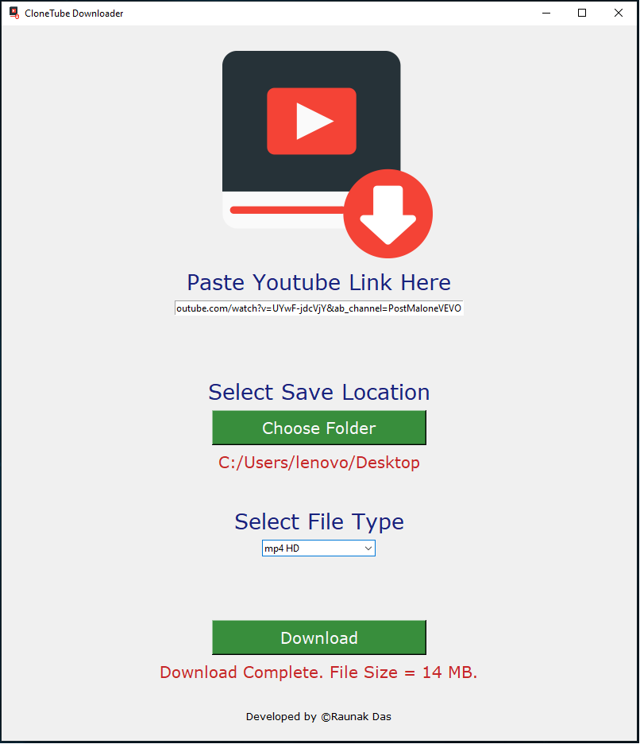

# clonetube-downloader

**Description** : GUI based YouTube Downloader

**Requisite** : Make sure you have Python3 installed in your System

**For Debian-based OS** :

1. Install requirements.txt to install necessary packages [**$ python3 -m pip install -r requirements.txt**]

2. Run clonetube.py to run the program [**$ python3 clonetube.py**]

**For Windows OS** :

1. Run executable file **clonetube.exe** to the run the program

2. If Windows fail to run **clonetube.exe**, then turnoff **Real-Time Protection in Windows Security** and re-run

**Sample Screenshot** :

